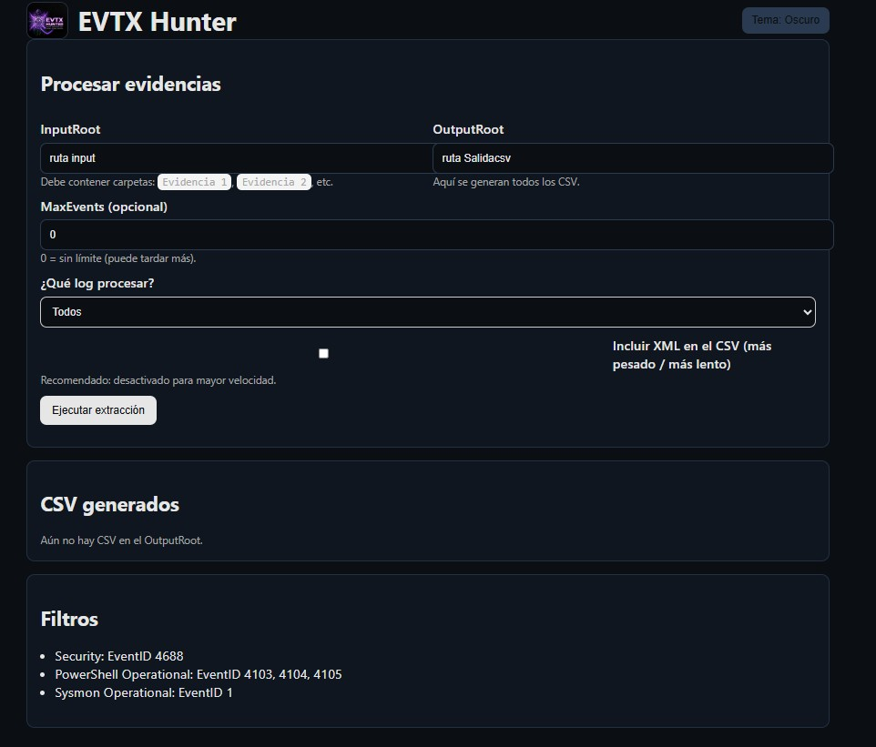

# EVTX Hunter


Manual de usuario para extraer eventos específicos desde archivos `.evtx` y exportarlos a `.csv`.

El flujo recomendado es usar la **UI Web** (Flask). La **API** es opcional.

## ¿Qué es EVTX Hunter y en qué puede ayudar?

EVTX Hunter es una herramienta en Python con interfaz web (Flask) para **extraer y exportar eventos específicos** desde archivos **EVTX** (evidencia offline) hacia **CSV**, organizada por **equipo/evidencia**.

Puede ayudarte a:

- Centralizar la extracción de eventos relevantes (por ejemplo, Security, PowerShell y Sysmon) desde múltiples evidencias.
- Acelerar el análisis inicial y el triage, generando CSV listos para filtrar/buscar.
- Mantener consistencia en la recolección al aplicar filtros de EventID y rango de tiempo de forma repetible.

## Muestra (UI)



 
## Creador
 
Andysitoop
 
## Qué hace
 
 - Procesa carpetas de evidencia dentro de `Input\`.
 - Genera CSV en `Salidacsv\` (o en la carpeta de salida que indiques).
 - Permite limitar eventos por archivo, incluir/excluir XML y elegir qué logs procesar.
 
## Guía rápida (UI)
 
 1. Coloca tu evidencia en `Input\Evidencia 1\`, `Input\Evidencia 2\`, etc.
 2. Instala dependencias.
 3. Ejecuta `python app.py`.
 4. Abre http://127.0.0.1:5000.
 5. Ejecuta la extracción y descarga los `.csv`.
 
 ## Preparar la evidencia (estructura y nombres)
 
 En la raíz del proyecto:
 
 - `Input\` (carpeta raíz de evidencia)
 - `Salidacsv\` (salida por defecto)
 
 Dentro de `Input\` crea carpetas por evidencia:
 
 - `Input\Evidencia 1\`
 - `Input\Evidencia 2\`
 - etc.
 
 En cada `Evidencia N` coloca los EVTX. El extractor intenta encontrar los siguientes nombres (también acepta algunas variantes):
 
 - `Security.evtx` (o `Security`)
 - `Microsoft-Windows-PowerShell%4Operational.evtx` (o `Windows PowerShell.evtx`)
 - `Microsoft-Windows-Sysmon%4Operational.evtx` (o `Sysmon.evtx` / `Sysmon`)
 
 ## Instalación
 
 Requisitos:
 
 - Python 3.x
 
 En PowerShell, desde la raíz del proyecto:
 
 ```powershell
 python -m venv .venv
 .\.venv\Scripts\Activate.ps1
 pip install -r requirements.txt
 ```
 
 ## Usar la aplicación (UI Web)
 
 ### 1) Iniciar
 
 ```powershell
 python app.py
 ```
 
 Abre:
 
 - http://127.0.0.1:5000
 
 ### 2) Configurar
 
 En la pantalla principal puedes ajustar:

Notas de UI:

- La interfaz está organizada en secciones: **Rutas**, **Filtros** y **Opciones**.
- Puedes usar el botón **Limpiar rango** para borrar Inicio/Fin y procesar completo.
- La UI muestra el motor usado al finalizar: `Motor: wevtutil` o `Motor: python-evtx`.
- Tema visual tipo **Purple Team**.
 
 - **input_root**: carpeta raíz de evidencia (por defecto `./Input`).
   - Debe contener subcarpetas tipo `Evidencia 1`, `Evidencia 2`, etc.
 
 - **output_root**: carpeta de salida (por defecto `./Salidacsv`).
   - Aquí se guardan los CSV y también es la carpeta que la UI lista para descargar.
 
 - **max_events**: máximo de eventos exportados por cada EVTX.
   - `0` = sin límite.
   - Útil si solo quieres una muestra rápida o si los EVTX son muy grandes.
 
 - **inicio/fin (opcional)**: rango de tiempo para filtrar eventos por `TimeCreated`.
   - Se selecciona como: **fecha + hora + minuto + AM/PM**.
   - Si dejas vacío Inicio o Fin, no se aplica ese límite.
   - Se interpreta como **hora local** y se convierte internamente a UTC.
 
 - **include_xml**: incluye o no la columna `Xml`.
   - Activado: el CSV contiene el XML completo del evento (más peso/tamaño).
   - Desactivado: CSV más liviano, con campos principales.
 
 - **logs_choice**: qué logs procesar.
   - `all`: procesa Security + PowerShell Operational + Sysmon.
   - `security`: solo `Security.evtx`.
   - `powershell`: solo `Microsoft-Windows-PowerShell%4Operational.evtx`.
   - `sysmon`: solo `Microsoft-Windows-Sysmon%4Operational.evtx` / `Sysmon`.
 
 ### 3) Ejecutar y descargar
 
 - Inicia la extracción desde el botón de ejecutar.
 - Al finalizar, la UI lista los `.csv` disponibles en la carpeta de salida.
 - Puedes descargar los archivos desde la misma UI.
 
 ## API (opcional)
 
 Si quieres automatizar (sin UI), puedes controlar la extracción vía JSON:
 
 - `POST /api/start`
 - `GET /api/status/<job_id>`
 - `POST /api/pause/<job_id>`
 - `POST /api/resume/<job_id>`
 - `POST /api/cancel/<job_id>`
 
 Ejemplo:
 
 ```powershell
 curl -Method Post http://127.0.0.1:5000/api/start -ContentType "application/json" -Body '{
   "input_root": "C:\\ruta\\al\\proyecto\\Input",
   "output_root": "C:\\ruta\\al\\proyecto\\Salidacsv",
   "max_events": 0,
   "start_time": "2022-01-01T00:00:00",
   "end_time": "2022-01-01T23:59:00",
   "include_xml": true,
   "logs_choice": "all"
 }'
 ```
 
 Notas API:
 
 - `start_time` y `end_time` se pueden enviar como ISO 8601. Si no incluyen zona horaria, se asumen como hora local.
 
 ## Resultados (qué CSV genera)
 
 Para cada `Evidencia N` y por cada log detectado, crea un CSV con estos filtros:
 
 - **Security**: EventID `4688`
 - **PowerShell Operational**: EventID `4103`, `4104`, `4105`
 - **Sysmon Operational**: EventID `1`
 
 Columnas incluidas:
 
 - `TimeCreated`, `Id`, `ProviderName`, `Level`, `MachineName`, `RecordId`
 - `Xml` (solo si `include_xml` está habilitado)
 
 ## Notas
 
 - La app genera nombres de archivo únicos si detecta colisiones en la carpeta de salida.
 - El flujo principal ya no depende del script PowerShell.
 
 ## Rendimiento
 
 Para acelerar la extracción manteniendo **100% exactitud**:
 
 - Si estás en Windows, el extractor intenta usar **`wevtutil`** como motor rápido (cuando es posible) y hace fallback a **`python-evtx`** si falla.
 - En la UI, al completar, se muestra un texto tipo `Motor: wevtutil` o `Motor: python-evtx`.
 - `include_xml` aumenta el tamaño del CSV y puede volver la exportación más lenta.
 - `max_events` ayuda a validar rápido (muestra) antes de extraer todo.
 
 ## Solución de problemas
 
 - **No se genera CSV para una evidencia**
   - Verifica que exista la carpeta `Input\Evidencia N\`.
   - Verifica que el EVTX exista y tenga uno de los nombres esperados (o variantes).
 
 - **Se genera CSV pero viene vacío**
   - Recuerda que la herramienta exporta solo los EventID indicados en “Resultados”.
   - Prueba ejecutando con `logs_choice=all`.
 
 - **La UI no abre**
   - Confirma que `python app.py` se esté ejecutando sin errores.
   - Abre exactamente http://127.0.0.1:5000.
